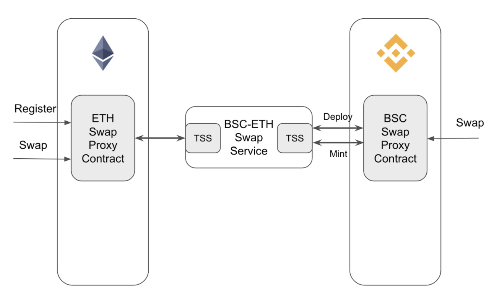

# ETH BSC Swap Contracts

## Overview
ETH BSC Swap Contracts are responsible for registering swap pairs and swapping assets between ETH and BSC.



### Register swap pair

1. Users register swap pair for erc20 token on ETH via ETHSwapAgent(`createSwapPair`) if token is not registered.
2. Swap service will monitor the `SwapPairRegister` event and create swap pair on BSC: 
    
    1. create an BEP20 token on BSC
    2. record the relation between erc20 token and bep20 token.

### Swap from ETH to BSC

Once swap pair is registered, users can swap tokens from ETH to BSC.

1. Users call `swapBSC2ETH` via ETHSwapAgent and specify erc20 token address, amount and swap fee.
2. Swap service will monitor the `SwapStarted` event and call `fillETH2BSCSwap` via BSCSwapAgent to mint corresponding bep20
tokens to the same address that initiate the swap.

### Swap from BSC to ETH

Once swap pair is registered, users can swap tokens from BSC to ETH.

1. Users call `swapBSC2ETH` via BSCSwapAgent and specify bep20 token address, amount and swap fee. Bep20 tokens will be burned.
2. Swap service will monitor the `SwapStarted` event and call `fillBSC2ETHSwap` via BSCSwapAgent to transfer corresponding erc20
   tokens to the same address that initiate the swap.

## Generate contracts from templates

```javascript
npm run generate
```

## Test

Generate test contracts from templates:
```javascript
npm run generate-test
```

Run tests:

```javascript
npm run truffle:test
```

Run coverage:

```javascript
npm run coverage
```
